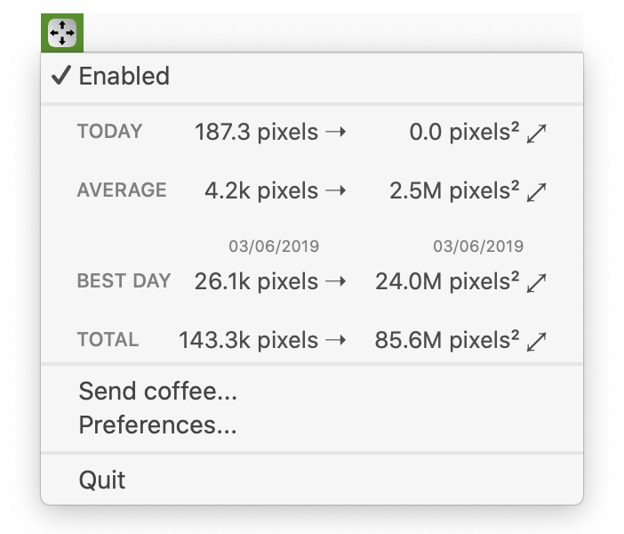
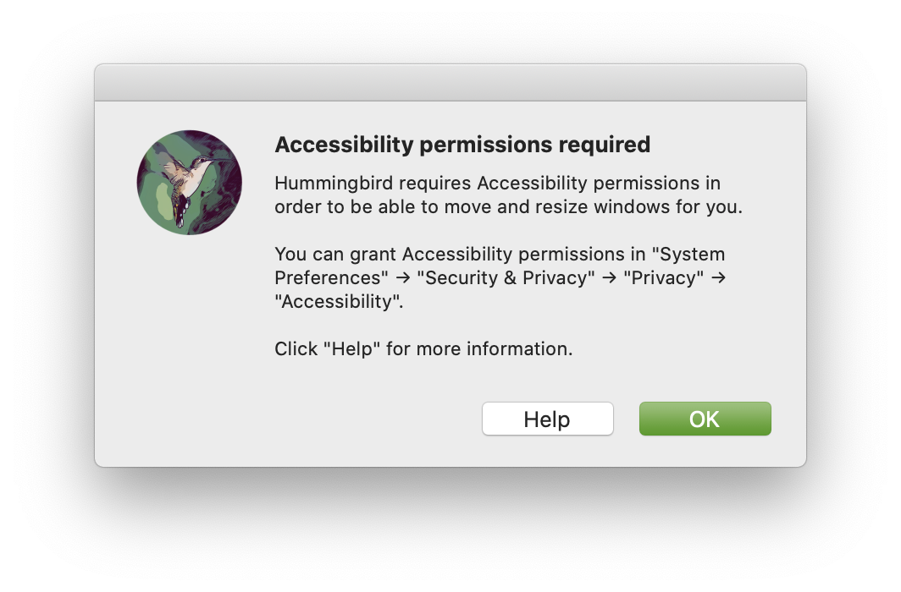
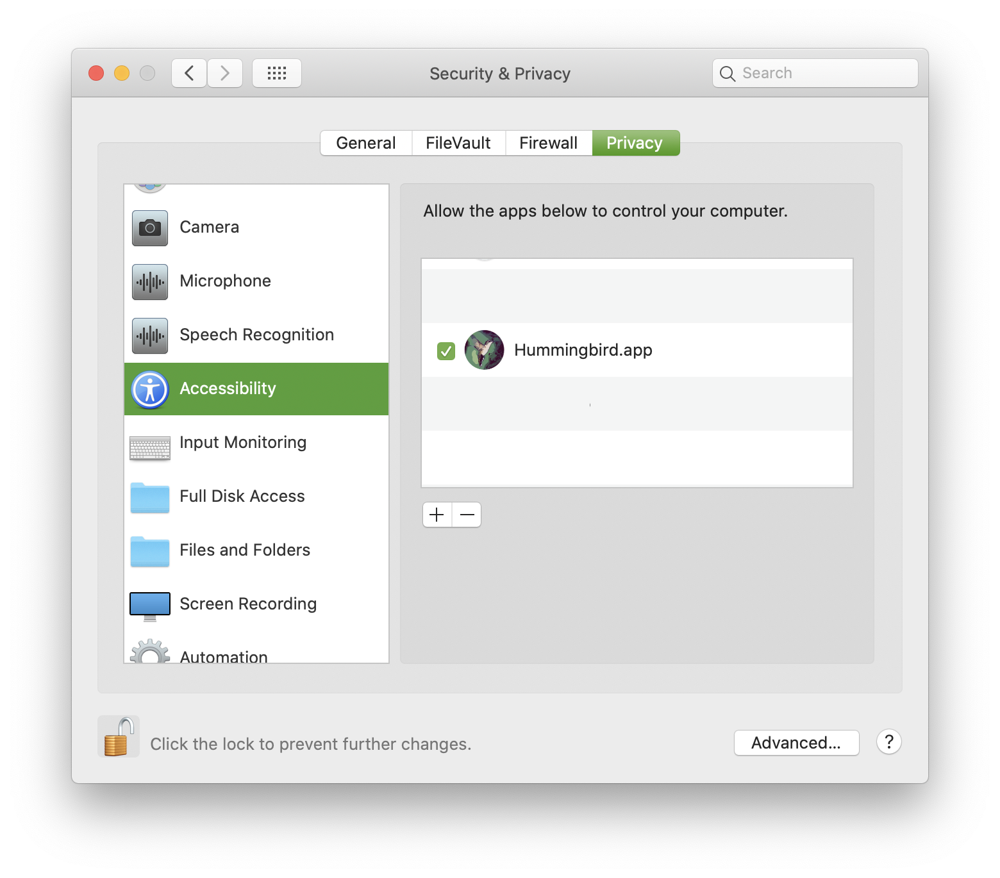
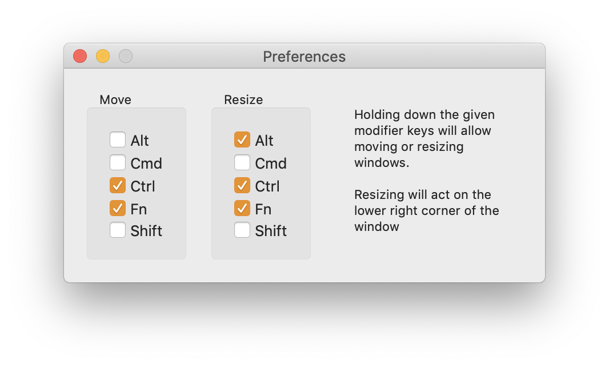

# Hummingbird

**Hummingbird is a macOS app to allow easy moving and resizing of windows by pressing modifier keys and moving your mouse pointer. Windows do not require focus, nor do you need to find the window edges.**

Hold down a modifier key combination like ⌃⌥ (control + option) and move you mouse pointer over a window to "grab" it anywhere to move it. Similarly, hold down another modifier key combination to resize the window as if you were dragging from the bottom right window corner from within anywhere in the window.

Hummingbird brings the move and resize behaviour known from Unix window managers to macOS.

[](https://vimeo.com/301631645)

In the video above, holding `fn` and `ctrl` while moving the mouse moves the window, and holding `alt` in addition allows the window to be resized simply by moving the mouse pointer. This is great for mouse users but is particularly helpful when using a trackpad, where clicking and holding can be a harder gesture to perform precisely.

## Installation

* Download the latest release from the [Hummingbird home page](http://hummingbirdapp.site)
* Unzip and run!

Or use [Homebrew](https://brew.sh):

```
brew tap finestructure/Hummingbird
brew cask install Hummingbird
```

Hummingbird has been tested on macOS 10.14 Mojave and 10.15 Catalina but it should run on earlier macOS versions as well (macOS 10.11 or higher).

## Usage

- After launching, Hummingbird is accessible via a menu bar item:

    

- However, on first use you will need to grant permissions for Accessibility Access. This is required so Hummingbird can move and resize windows. You will see an alert directing you to System Preferences:

    

- In System Preferences / Security & Privacy / Privacy, please authenticate and make sure the entry for "Hummingbird" under "Accessibility" is checked as indicated below.

    

- You can configure the move and resize keyboard shortcuts in Hummingbird's preferences:

    


## Contributing

[Contributions](contributing.md) welcome!

## Credits: Easy Move+Resize by Daniel Marcotte

This project is a fork of the [original project](https://github.com/dmarcotte/easy-move-resize) by [Daniel Marcotte](https://github.com/dmarcotte). His project uses mouse click based tracking, which I modified to use mouse moving instead.

Daniel suggested to fork and rename the project to avoid confusion.
